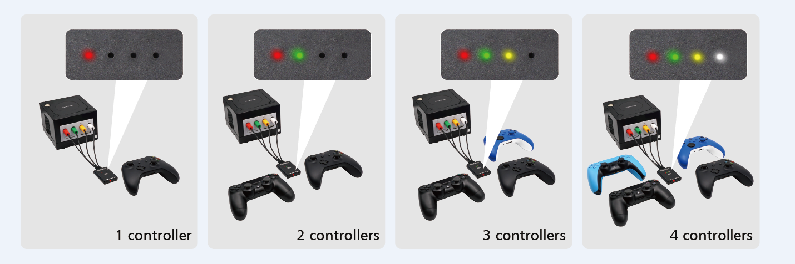

# About this fork
This is a fork from darthcloud blueretro source with the following changes:

* You can connect 8bitdo m30 controller in DInput mode - "start + B" (Since Blueretro official 1.8.2 the m30 can only be connected in X-Input or Switch mode) 

* Fix the color leds on Retroscaler Gamecube 4 Port Blueretro - The color leds only work with the firmware that comes preinstalled on the aliexpress device. They used different pinouts for the Leds and that's not supported on official Bluretro firmware. (The red/green/yellow/white player LEDs are connected to GPIO 14/32/33/25 respectively). 

Update on 08.02.2023 - Updated to import the solution shared by Retroscaler Team (https://github.com/RetroScaler/NGC-BlueRetro/)

Update on 28.04.2024 - After this PR https://github.com/darthcloud/BlueRetro/pull/886, the official firmware added a config system that can set alternate GPIOs for the leds, but just changing the leds GPIO numbers was not enough the make then work again.

IMPORTANT - To compile the retroscaler leds version of the gamecube adapter you must copy configs/hw1/gamecube_rsleds to sdkconfig - configs/hw1/gamecube will compile the default version

* Rumble is enabled by default

I've also created a preset specific for emulators on nintendo wii using this gamecube ports blueretro device. You can load it navigating to (https://psicotron3.github.io/BlueRetroWebCfg/presets.html) and selecting the preset "GameCube Ports on Wii For Emulation". This preset works with the default retroarch-wii mapping for gamecube controllers:

- Map face buttons to the corresponding label on a Switch Pro Controller (A on Switch Pro to A on GC, B to B and so on)
- Z to minus (select)
- R and L to corresponding digital and analog triggers
- RZ and LZ to corresponding digital and analog triggers
- Capture and Home mapped to Right and Left on Left Gamecube Analog (open menu on some wii emulators)
OBS: Since 1.9.1 we need to map digital and analog gamecube LR. Mapping only Digital LR won't work. 

That was necessary because on gamecube blueretro, L1 AND R1 are mapped to the same button Gamecube Z. It's not very useful when using retroarch on nintendo wii to emulate Sega/Nintendo Consoles on a Wii Console. Also, Retroarch and other wii emulators will work very well, out of the box, if Gamecube face buttons name correspond to their letters (B Gamecube is mapped to B-Face Button Down, A Gamecube is mapped to A-Face Button Right, and so on). The preset above solves those "issues".

# About the 8BitDo M30 Controller:

With the preset above, 8bitdo m30 in D-Input (or Switch) mode can be used to play emulated games on Wii without any other button mapping (only on genesis emulator it is necessary to configure a custom mapping to put the buttons on their respective place).

D-Input mode is needed because, since 8bitdo m30 firmware 1.13, the controller maps the buttons in a strange way on X-Input mode. Buttons L/L2 to m30 Z/C and R/R2 to m30 L/R. While on D-Input mode, buttons as mapped as expected: shoulders buttons L1/R1 are mapped to Z/C on m30 and L2/R2 to L/R on m30. 

When darthcloud added support for 8bitdo on version 1.8, m30 controller D-Input stopped working and, at that time, Switch mode was working but with connection issues (it's fixed now).

Blueretro officel implementation fix the 8bitdo x-input strange mapping mentioned above making L1/R1 correspond to X/Z. But note, it's still different from D-Input L1/R1 to Z/C. And the necessary mapping on BlueRetro to m30 X-Input make a big mess with every other controllers buttons placement on wii reatroarch.

The dirty and easy fix to this was to restore 8bitdo D-Input mode support, with buttons on right place. (Note that, if m30 is connected in X-Input mode, nothing will change from the official behavior).

# Disclaimer

This fork is not supported by Darthcloud and is intented only for Retroscaler Gamecube 4 Port Blueretro (version 1.2):

# BlueRetro

 

BlueRetro is a multiplayer Bluetooth controllers adapter for various retro game consoles. Lost or broken controllers? Reproduction too expensive? Need those rare and obscure accessories? Just use the Bluetooth devices you already got! The project is open source hardware & software under the CERN-OHL-P-2.0 & Apache-2.0 licenses respectively. It's built for the popular ESP32 chip. Wii, Switch, PS3, PS4, PS5, Xbox One, Xbox Series X|S & generic HID Bluetooth (BR/EDR & LE) devices are supported. Parallel 1P (NeoGeo, Supergun, JAMMA, Handheld, etc), Parallel 2P (Atari 2600/7800, Master System, etc), NES, PCE / TG16, Mega Drive / Genesis, SNES, CD-i, 3DO, Jaguar, Saturn, PSX, PC-FX, JVS (Arcade), Virtual Boy, N64, Dreamcast, PS2, GameCube & Wii extension are supported with simultaneous 4+ players using a single adapter.

## READ THIS FIRST
* [Project documentation](https://github.com/darthcloud/BlueRetro/wiki)

## Need help?
* [Open a GitHub discussion](https://github.com/darthcloud/BlueRetro/discussions)

## Commercial solution sponsoring BlueRetro FW development
Buying these commercial adapters help the continued development of the BlueRetro firmware!!\
Thanks to all sponsors!!

* JagBT by [Humble Bazooka](https://twitter.com/humblebazooka): Atari Jaguar single port dongle.\
  https://www.humblebazooka.com/products/jag-bt-bluetooth-controller-adapter-for-the-atari-jaguar/
* Neo Geo BT by [Humble Bazooka](https://twitter.com/humblebazooka): SNK Neo Geo single port dongle.\
  https://www.humblebazooka.com/products/neo-bt-neo-geo-bluetooth-adapter/
* PCE BT by [Humble Bazooka](https://twitter.com/humblebazooka): NEC PC-Engine dongle.\
  https://www.humblebazooka.com/product/pce-bt-pc-engine-bluetooth-adapter/
* Turbo BT by [Humble Bazooka](https://twitter.com/humblebazooka): NEC TurboGrafx-16 dongle.\
  https://www.humblebazooka.com/product/turbo-bt-turbografx-16-bluetooth-adapter/
* 3DO BT by [Humble Bazooka](https://twitter.com/humblebazooka): 3DO dongle.\
  https://www.humblebazooka.com/products/3do-bt-3do-bluetooth-adapter
* Saturn BT by [Humble Bazooka](https://twitter.com/humblebazooka): Saturn dongle.\
  https://www.humblebazooka.com/products/saturn-bt-bluetooth-adapter-for-the-sega-saturn/

 
  

* N64 Bluetooth Controller Receiver by [bixxewoscht](https://twitter.com/bixxewoscht): N64 single port dongle.\
  https://8bitmods.com/n64-blueretro-bt-controller-receiver-with-memory-pak-original-grey/

 

* Virtual Boy BlueRetro Adapter by [RetroOnyx](https://twitter.com/mellott124): Virtual Boy dongle.\
  https://www.retroonyx.com/product-page/virtual-boy-blueretro-adapter

 
  
  
* RetroScaler Mini Blueretro Wireless Game Controller Adapter for PS1 PS2 by [RetroScaler](https://twitter.com/RetroScaler): PS1 & PS2 single port dongle.\
  https://www.aliexpress.us/item/3256805870708776.html?gatewayAdapt=glo2usa4itemAdapt
* RetroScaler Blueretro Wireless Game Controller Adapter for NEO.GEO by [RetroScaler](https://twitter.com/RetroScaler): Neo-Geo single port dongle.\
  https://www.aliexpress.us/item/3256806140926261.html?gatewayAdapt=glo2usa4itemAdapt
* RetroScaler Blueretro Wireless Game Controller Adapter for SNES SFC by [RetroScaler](https://twitter.com/RetroScaler): SFC/SNES single port adapter.\
  https://www.aliexpress.us/item/3256805054285627.html?gatewayAdapt=glo2usa4itemAdapt

 
  

* GameCube Blue Retro Internal Adapter by [Laser Bear Industries](https://twitter.com/collingall): GameCube controller PCB replacement with integrated BlueRetro.\
  https://www.laserbear.net/products/gamecube-blue-retro-internal-adapter \
  https://8bitmods.com/internal-bluetooth-blueretro-adapter-for-gamecube/

 
  

* RetroRosetta by [GrechTech](https://twitter.com/GrechTech): BlueRetro universal core and cables.\
  http://www.grechtech.co.uk/

## Community Contribution
* BlueRetro PS1/2 Receiver by [mi213 ](https://twitter.com/mi213ger): 3D printed case & PCB for building DIY PS1/2 dongle.\
  https://github.com/Micha213/BlueRetro-PS1-2-Receiver
* N64 BlueRetro Mount by [reventlow64](https://twitter.com/reventlow): 3d printed mount for ESP32-DevkitC for N64.\
  https://www.prusaprinters.org/prints/90275-nintendo-64-blueretro-bluetooth-receiver-mount
* BlueRetro Adapter Case by [Sigismond0](https://twitter.com/Sigismond0): 3d printed case for ESP32-DevkitC.\
  https://www.prusaprinters.org/prints/116729-blueretro-bluetooth-controller-adapter-case
* BlueRetro AIO by [pmgducati](https://github.com/pmgducati): BlueRetro Through-hole base and cable PCBs.\
  https://github.com/pmgducati/Blue-Retro-AIO-Units
* BlueRetro HW2 internal guides by [Nostalgic Indulgences](https://twitter.com/nosIndulgences): Internal install guides\
  https://github.com/nostalgic-indulgences/BlueRetro_Internal_Installation
* BlueRetro latency test by [GamingNJncos](https://twitter.com/GamingNJncos): Documentation on how to run BlueRetro latency test\
  https://github.com/GamingNJncos/BLE-3D-Saturn-Public/tree/main/BlueRetro_Latency_Testing
* BR4N64 by [TharathielCB](https://github.com/TharathielCB): Internal BlueRetro Flex-PCB for Nintendo 64\
  https://github.com/TharathielCB/BR4N64

 

